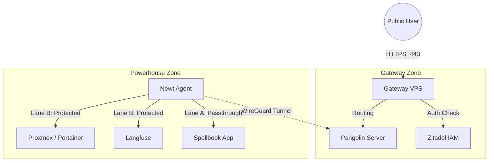

# Architecture & Design

This document outlines the architectural decisions, networking flow, and security principles driving the KyleHub platform.

## 1. High-Level Concept: "The Bridge"

The architecture is split into two security zones: **The Gateway** (Public) and **The Powerhouse** (Private). They are bridged by a secure WireGuard tunnel managed by Pangolin.

## 2. Networking Strategy

### Zero Open Ports
The Homelab has **ZERO** open ports on the router. It does not use DDNS or Port Forwarding. All ingress traffic initiates from the `Newt` agent dialing out to the VPS.

### The "Two-Lane" Traffic Policy
We distinguish between applications that handle their own security ("Smart") and those that don't ("Dumb").

#### Lane A: The "Smart App" Route (Public/Passthrough)
*   **Target:** Custom developed apps (Spellbook, Hatchery).
*   **Mechanism:** Pangolin acts purely as a tunnel and Load Balancer.
*   **Security:** The application itself integrates the `Identity Kit` to perform OIDC handshakes with Zitadel.
*   **Benefit:** Seamless User Experience (No double login).

#### Lane B: The "Infra App" Route (Auth Gateway)
*   **Target:** Admin tools (Proxmox, Portainer, Langfuse).
*   **Mechanism:** Pangolin enforces authentication *before* allowing connection.
*   **Security:** Access is blocked at the network edge until the user logs in via Zitadel (OIDC).
*   **Benefit:** Zero Trust access to insecure internal tools.

## 3. Authentication & Identity

**Zitadel** is the single source of truth for all identities.

*   **Protocol:** OIDC (OpenID Connect).
*   **Location:** Running on the VPS to ensure high availability (Auth works even if the homelab is down).
*   **Integration:**
    *   **Pangolin:** Uses Zitadel as an OIDC Provider for "Lane B" protection.
    *   **Custom Apps:** Use the Python `identity-kit` to validate tokens against Zitadel.

## 4. Mail & Notifications

To protect the Homelab IP reputation and ensure deliverability, all email sending is offloaded to the VPS.

*   **Provider:** Proton Mail (via Proton Bridge).
*   **Middleware:** Postfix (SMTP Relay).
*   **Flow:** `App (Homelab) -> SMTP -> Postfix (VPS) -> Proton Bridge -> Internet`.

## 5. Deployment Workflow (Sparse Checkout)

To maintain a clean separation of concerns within a Monorepo:

1.  **Development:** The Admin works on the full repo locally.
2.  **VPS Deployment:**
    *   Git Config: `git sparse-checkout set gateway-vps`
    *   Result: The VPS only sees ingress/auth code. It has no access to Homelab secrets.
3.  **Homelab Deployment:**
    *   Git Config: `git sparse-checkout set homelab-core`
    *   Result: The Homelab only pulls application code.

## 6. Future Scalability

*   **New Services:** Add them to `homelab-core/services/`.
*   **New Nodes:** Deploy another `Newt` agent on a new server to instantly mesh it into the network.
*   **Backup:** Since config and data are separated (Volumes in `./services/x/data`), backup strategies simply need to target the `services/` directory.