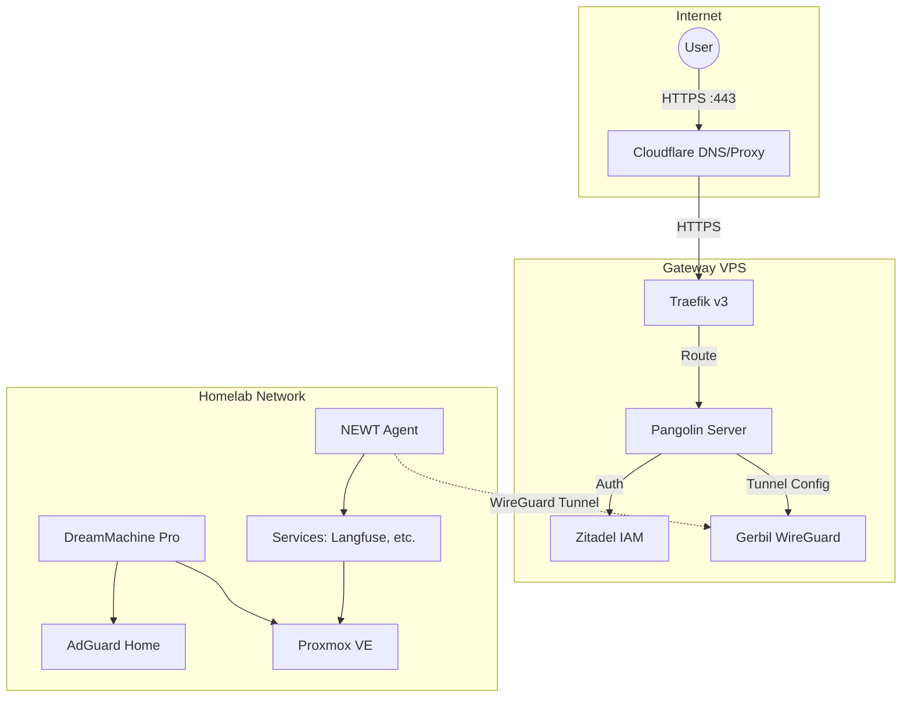
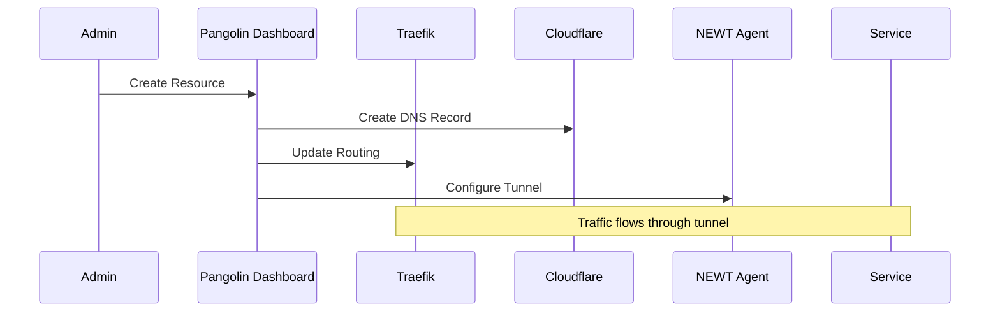

# Architecture & Design

This document outlines the architectural decisions, networking flow, and security principles driving the KyleHub platform.

---

## 1. High-Level Architecture

The infrastructure is split into two security zones connected by secure tunnels:

| Zone | Location | Purpose |
|------|----------|---------|
| **Gateway** | Cloud VPS (Hetzner) | Public ingress, authentication, reverse proxy |
| **Homelab** | Private Network | Compute, storage, AI workloads, private services |



---

## 2. Network Architecture

### 2.1 Zero Open Ports Policy

The homelab maintains **zero open ports** on the router/firewall. All ingress traffic:

1. Enters through the VPS (ports 80/443)
2. Routes through Traefik → Pangolin
3. Traverses the WireGuard tunnel to NEWT
4. Reaches the target service internally

This eliminates the need for DDNS, port forwarding, or exposing the home IP.

### 2.2 Homelab Network Stack

| Component | Role | IP/Network |
|-----------|------|------------|
| **UniFi DreamMachine Pro** | Router/Firewall | Gateway for all networks |
| **AdGuard Home** | DNS + Ad blocking | Container on Proxmox |
| **Proxmox VE** | Hypervisor | Hosts all VMs/LXCs |
| **NEWT Agent** | Tunnel client | Connects to VPS |

### 2.3 VPS Network Stack

| Component | Role | Ports |
|-----------|------|-------|
| **Gerbil** | WireGuard server | 51820/udp, 21820/udp |
| **Traefik** | Edge router | 80, 443 |
| **Pangolin** | Zero Trust proxy | Internal: 3000-3002 |
| **Zitadel** | Identity provider | Internal: 8080 |

---

## 3. Traffic Flow Patterns

### 3.1 Pattern A: Passthrough (Smart Apps)

For applications with built-in authentication (using Identity Kit):

```
User → Cloudflare → Traefik → Pangolin → NEWT Tunnel → App
                                                         ↓
                                                    App validates
                                                    token with Zitadel
```

- Pangolin acts as a pure tunnel/load balancer
- App handles its own OIDC flow with Zitadel
- No double authentication

### 3.2 Pattern B: Auth Gateway (Infrastructure Apps)

For tools without native SSO (Proxmox, Portainer, legacy apps):

```
User → Cloudflare → Traefik → Pangolin → Zitadel Auth Check
                                              ↓
                                        If Authenticated
                                              ↓
                                    NEWT Tunnel → App
```

- Pangolin enforces authentication before allowing access
- User must log in via Zitadel OIDC
- Zero Trust access to internal tools

---

## 4. Authentication & Identity

### 4.1 Zitadel as Single Source of Truth

| Feature | Implementation |
|---------|----------------|
| **Protocol** | OIDC (OpenID Connect) |
| **Location** | VPS (high availability) |
| **Organization** | KHOps (management org) |
| **Project** | KyleHub |
| **Application** | KyleHub-Auth |

### 4.2 Role Taxonomy

Two-layer role system for flexible access control:

| Type | Examples | Purpose |
|------|----------|---------|
| **Category Roles** | `admin`, `homelab`, `media`, `dev` | Grant access to service categories |
| **Service Roles** | `access_grafana`, `access_proxmox` | Grant access to specific services |

### 4.3 Integration Points

- **Pangolin**: Uses Zitadel for auth gateway (Pattern B)
- **Custom Apps**: Use [Identity Kit](https://github.com/KyleHub-Dev/identity-kit) for OIDC
- **Proxmox**: Direct OIDC integration (optional)
- **Grafana/Portainer**: Native OIDC support

---

## 5. Service Exposure Flow

When exposing a new service through Pangolin:

1. **Create Site** → Logical grouping (e.g., "Homelab Services")
2. **Add NEWT Agent** → Connects homelab to VPS tunnel
3. **Create Resource** → Define subdomain, target IP/port
4. **Configure Auth** → Enable Zitadel protection if needed
5. **DNS Auto-Config** → Pangolin manages Cloudflare DNS



---

## 6. Deployment Model

### 6.1 Monorepo with Sparse Checkout

The repository supports partial deployment:

```bash
# VPS: Only pulls gateway-vps/
git sparse-checkout set gateway-vps

# Homelab: Only pulls homelab-core/
git sparse-checkout set homelab-core
```

Benefits:
- Secrets stay isolated per environment
- Smaller deployments
- Clear separation of concerns

### 6.2 Configuration Flow

```
.env.example → .env → init_config.sh → config.yml
                ↓
         docker compose up
                ↓
    Post-deploy config in Pangolin Dashboard
```

---

## 7. Future Roadmap

| Feature | Status | Notes |
|---------|--------|-------|
| AdGuard Home integration | Planned | Network-wide DNS/ad blocking |
| Additional NEWT sites | Planned | Multi-location homelab support |
| Backup automation | Planned | Automated volume backups |
| Monitoring stack | Future | Grafana, Prometheus, Loki |
| AI/LLM infrastructure | In Progress | Langfuse, Ollama, etc. |

---

## 8. Security Principles

1. **Zero Trust**: Every request is authenticated, even internal
2. **Defense in Depth**: Multiple layers (Cloudflare → Firewall → Pangolin → App)
3. **Least Privilege**: Role-based access with minimal permissions
4. **Encrypted Transit**: All traffic over HTTPS or WireGuard
5. **Secret Management**: Environment variables, not committed to git

---

*Last Updated: January 2026*