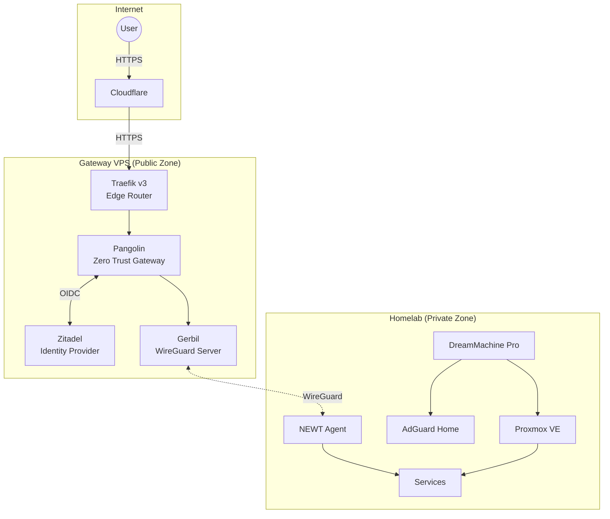
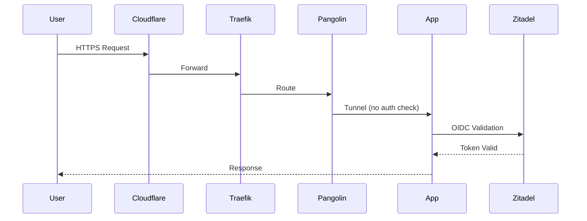
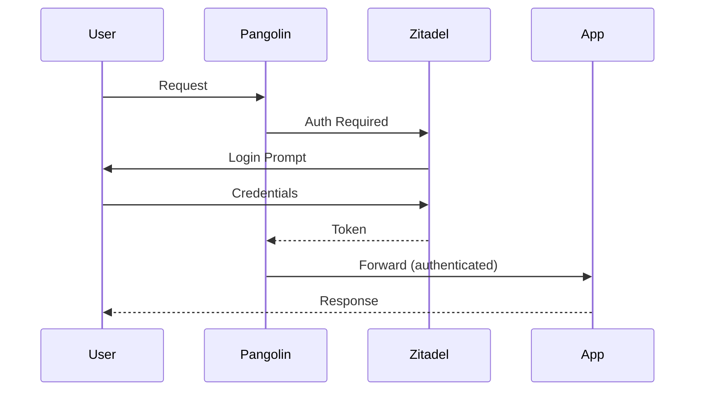
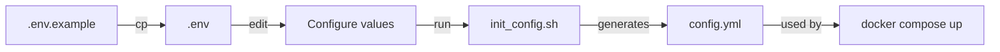
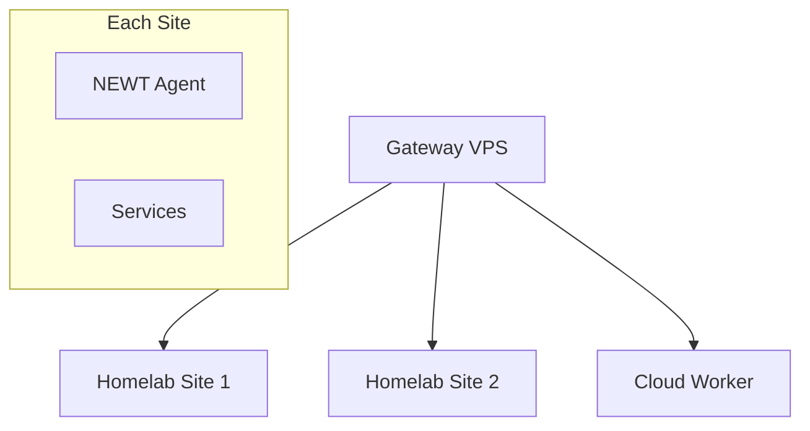

# Architecture Overview

This document provides a comprehensive overview of the KyleHub Infrastructure architecture, covering networking, security, and service deployment patterns.

---

## High-Level Architecture

KyleHub Infrastructure implements a **hybrid cloud architecture** split into two security zones:



---

## Network Architecture

### Zero Open Ports

The homelab maintains **zero open inbound ports**. All traffic flows:

1. **Inbound**: Internet → Cloudflare → VPS → WireGuard Tunnel → Homelab
2. **Outbound**: Homelab → NEWT Agent → WireGuard Tunnel → VPS

This eliminates the need for:
- Port forwarding
- Dynamic DNS (DDNS)
- Exposing your home IP address

### Network Components

| Component | Role | Location |
|-----------|------|----------|
| **Cloudflare** | DNS, DDoS protection, optional proxy | Cloud |
| **Traefik** | Edge router, SSL termination | VPS |
| **Pangolin** | Reverse proxy, tunnel management | VPS |
| **Gerbil** | WireGuard server endpoint | VPS |
| **NEWT** | WireGuard client, tunnel agent | Homelab |
| **DreamMachine Pro** | Router, firewall | Homelab |
| **AdGuard Home** | DNS, ad blocking | Homelab |

### Port Mapping

#### VPS (External)

| Port | Protocol | Service |
|------|----------|---------|
| 80 | TCP | HTTP (redirect to HTTPS) |
| 443 | TCP | HTTPS (all services) |
| 51820 | UDP | WireGuard (primary) |
| 21820 | UDP | WireGuard (secondary) |

#### Internal Services

| Service | Port | Access |
|---------|------|--------|
| Pangolin API | 3000 | Internal |
| Pangolin Dashboard | 3002 | Via Traefik |
| Zitadel | 8080 | Via Traefik |
| Zitadel Login | 3000 | Internal sidecar |

---

## Traffic Flow Patterns

### Pattern A: Passthrough (Smart Apps)

For applications with built-in OIDC support:



**Use for:** Custom apps using Identity Kit, services with native SSO

### Pattern B: Auth Gateway (Infrastructure Apps)

For admin tools without native SSO:



**Use for:** Proxmox, Portainer, Langfuse, legacy apps

---

## Authentication Architecture

### Zitadel as Identity Provider

Zitadel serves as the **single source of truth** for all identities:

| Feature | Implementation |
|---------|----------------|
| Protocol | OIDC (OpenID Connect) |
| Location | VPS (high availability) |
| MFA | TOTP, WebAuthn |
| Sessions | JWT tokens |

### Role-Based Access Control

Two-tier role system:

| Tier | Role Type | Examples | Scope |
|------|-----------|----------|-------|
| 1 | **Category** | `admin`, `homelab`, `dev` | Service groups |
| 2 | **Service** | `access_grafana`, `access_proxmox` | Individual services |

Example role assignments:

```
admin         → Full access to all services
homelab       → Access to *.homelab.yourdomain.com
access_grafana → Access only to grafana.yourdomain.com
```

### Integration Points

| Service | Integration Type |
|---------|-----------------|
| Pangolin | OIDC Auth Gateway |
| Custom Apps | Identity Kit (Python/JS) |
| Proxmox | Direct OIDC |
| Grafana | Native OIDC |
| Portainer | OAuth2 |

---

## Service Architecture

### Gateway VPS Services

```yaml
services:
  pangolin:      # Zero Trust reverse proxy
  zitadel:       # Identity provider
  zitadel_login: # Login UI (v2)
  zitadel_db:    # PostgreSQL database
  gerbil:        # WireGuard tunnel endpoint
  traefik:       # Edge router + SSL
```

### Homelab Core Services

```yaml
services:
  newt:          # WireGuard tunnel client
  langfuse:      # LLM observability
  # Add more services as needed
```

### Adding New Services

1. Add service to `homelab-core/compose.yaml`
2. Create NEWT resource in Pangolin dashboard
3. Configure authentication (if needed)
4. DNS is auto-configured via Pangolin

---

## Deployment Architecture

### Monorepo Structure

```
infrastructure/
├── gateway-vps/      # Deployed to VPS
│   ├── compose.yaml
│   ├── .env
│   └── config/
│
└── homelab-core/     # Deployed to homelab
    ├── compose.yaml
    ├── .env
    └── services/
```

### Sparse Checkout (Optional)

For production, each environment only pulls its folder:

```bash
# On VPS
git sparse-checkout set gateway-vps

# On Homelab
git sparse-checkout set homelab-core
```

### Configuration Flow



---

## Security Architecture

### Defense in Depth

```
Layer 1: Cloudflare      → DDoS protection, WAF (optional)
Layer 2: VPS Firewall    → IP allowlisting for SSH, Cloudflare IPs only for 80/443
Layer 3: Traefik         → SSL/TLS, rate limiting
Layer 4: Pangolin        → Zero Trust authentication
Layer 5: Application     → App-level authorization
```

### Security Principles

1. **Zero Trust**: Every request authenticated, even internal
2. **Least Privilege**: Minimal role-based permissions
3. **Encrypted Transit**: HTTPS externally, WireGuard for tunnels
4. **Secret Management**: Environment variables, never in git
5. **Isolation**: VPS has no access to homelab secrets

---

## Future Architecture

### Planned Enhancements

| Feature | Description | Status |
|---------|-------------|--------|
| AdGuard Home | Network-wide DNS/ad blocking | Planned |
| Multi-site NEWT | Multiple homelab locations | Planned |
| Monitoring Stack | Grafana, Prometheus, Loki | Future |
| Automated Backups | Volume backup automation | Future |

### Scalability Path



New locations simply deploy a NEWT agent and connect to the VPS gateway.
