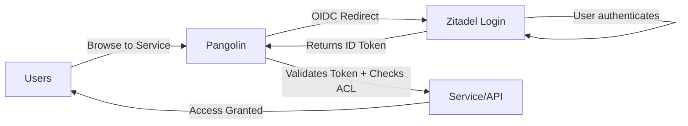

# Zitadel Setup

Zitadel is the **authoritative identity provider** for your infrastructure. It manages all user identities, authentication, and provides SSO to Pangolin and all downstream services.

---

## Architecture



**Flow:**
1. User tries to access a protected resource
2. Pangolin redirects to Zitadel for authentication
3. User logs in with Zitadel credentials (Pangolin never sees the password)
4. Zitadel returns an ID token with user claims and roles
5. Pangolin validates the token and grants access based on policies

---

## Overview

Zitadel provides:
- **Single Sign-On (SSO)** across all services via OIDC/OAuth2
- **Authoritative identity** — single source of truth for users and roles
- **Multi-factor authentication** (MFA)
- **User self-service** (password reset, profile management)
- **Role-based access control** (RBAC) — integrated with Pangolin policies
- **Audit logging** — track all authentication events

---

## Expose Zitadel via Pangolin

Before accessing Zitadel, you need to create a resource in Pangolin to route traffic to the Zitadel containers.

### 1. Create the Zitadel Resource

1. Open **Pangolin Dashboard** (`https://pangolin.yourdomain.com`)
2. Navigate to your site → **Resources** → **Add Resource**
3. Configure the resource:

| Field | Value |
|-------|-------|
| **Name** | Zitadel |
| **Subdomain** | `auth` (or your chosen subdomain) |
| **Domain** | `yourdomain.com` |

### 2. Configure Target Routing

Zitadel uses a **Login V2 sidecar** that requires path-based routing. Enable **Advanced Mode** and configure two targets:

| Match Path | Type | Host | Port | Priority |
|------------|------|------|------|----------|
| `/ui/v2/login` | Prefix | `zitadel_login` | `3000` | **200** |
| *(empty)* | — | `zitadel` | `8080` | 100 |

:::warning Priority Order
The `/ui/v2/login` route **must have higher priority** (200) than the catch-all route (100) to ensure login requests go to the correct backend.
:::

### 3. Save and Verify

1. Click **Save**
2. Wait for the SSL certificate to provision
3. Open `https://auth.yourdomain.com` — you should see the Zitadel login page

---

## Initial Access

After deploying the Gateway VPS stack, access Zitadel:

1. Open `https://auth.yourdomain.com` in your browser
2. Log in with the default admin credentials:
   - **Username**: `zitadel-admin@zitadel.localhost`
   - **Password**: Check the logs for the initial password

```bash
docker compose logs zitadel | grep -i password
```

:::warning Change Default Password
Immediately change the default admin password after first login.
:::

---

## Initial Configuration

### 1. Create Your Organization

1. Go to **Organization** in the sidebar
2. Click **New Organization**
3. Enter your organization name (e.g., `KyleHub`)
4. Set your domain (e.g., `kylehub.dev`)

### 2. Create the Main Project

1. Navigate to **Projects**
2. Click **Create New Project**
3. Name it `KyleHub` (or your project name)
4. Enable **Assert Roles on Authentication**

### 3. Create the Auth Application

This application represents **Pangolin's OIDC integration**. Pangolin will use this application's credentials to authenticate users via Zitadel.

1. Inside your project, click **New** → **Application**
2. Configure:
   - **Name**: `KyleHub-Auth` (represents Pangolin)
   - **Type**: Web
   - **Authentication Method**: Code (PKCE optional)

3. Add Redirect URIs (where Zitadel returns the user after login):
   ```
   https://pangolin.yourdomain.com/auth/callback
   https://pangolin.yourdomain.com/api/v1/auth/idp/callback
   ```

4. Add Post-Logout URIs (where user is sent after logout):
   ```
   https://pangolin.yourdomain.com
   ```

5. **Save** and copy the **Client ID** and **Client Secret**

:::tip Save Credentials
Store the Client ID and Client Secret securely. You'll use them in [Post-Deployment Setup](./post-deployment#3-configure-identity-provider) to configure Pangolin's identity provider.
:::

:::note Application Purpose
This application is **not for users to log into directly**—it's for Pangolin to authenticate users. Users will see Zitadel's login UI at `https://auth.yourdomain.com`, then be returned to their requested resource in Pangolin after successful authentication.
:::

---

## Role Configuration

### Create Category Roles

Create roles for different access levels:

1. Go to **Projects** → **KyleHub** → **Roles**
2. Create these roles:

| Role Key | Display Name | Description |
|----------|--------------|-------------|
| `admin` | Administrator | Full access to all services |
| `homelab` | Homelab Access | Access to homelab services |
| `services` | Services | Access to general services |
| `dev` | Developer | Access to development tools |

### Assign Roles to Users

1. Go to **Users** → Select a user
2. Navigate to **Authorizations**
3. Add authorization for the `KyleHub` project
4. Select appropriate roles

---

## Token Configuration

Configure how tokens include role information:

1. Go to **Projects** → **KyleHub** → **Settings**
2. Enable:
   - ✅ **Assert Roles on Authentication**
   - ✅ **Include Roles in User Info**

3. Go to **Applications** → **KyleHub-Auth** → **Token Settings**
4. Enable:
   - ✅ **Add User Roles to Access Token**
   - ✅ **Add User Roles to ID Token**

This ensures Pangolin can read user roles from the token.

---

## Integrate with Pangolin

### 1. Open Pangolin Admin

Navigate to `https://pangolin.yourdomain.com` and go to **Admin** → **Identity Providers**.

### 2. Add Identity Provider

Click **Add Identity Provider** and configure:

| Field | Value |
|-------|-------|
| **Name** | Zitadel |
| **Auto Provision** | ON |
| **Provider Type** | OAuth2/OIDC |
| **Client ID** | From Zitadel |
| **Client Secret** | From Zitadel |
| **Authorization URL** | `https://auth.yourdomain.com/oauth/v2/authorize` |
| **Token URL** | `http://auth.yourdomain.com:8080/oauth/v2/token` |
| **Scopes** | `openid profile email` |

:::warning URL Configuration
- **Authorization URL**: Use external HTTPS (user's browser)
- **Token URL**: Use internal HTTP with port 8080 (server-side)

This prevents issues with Cloudflare proxy blocking API calls.
:::

### 3. Configure Token Mapping

| Field | Value |
|-------|-------|
| **Identifier Path** | `sub` |
| **Email Path** | `email` |
| **Name Path** | `name` |
| **Roles Claim Path** | `"urn:zitadel:iam:org:project:roles"` |

:::tip JMESPath Syntax
Wrap the roles claim path in quotes due to the colons in the path.
:::

### 4. Save and Copy Callback URL

After saving, copy the generated **Callback URL** from Pangolin.

### 5. Update Zitadel Redirect URIs

Go back to Zitadel → **Applications** → **KyleHub-Auth** → **Redirect Settings**.

Add the Pangolin callback URL to the redirect URIs.

---

## Testing Authentication

### 1. Create a Test User

1. In Zitadel, go to **Users** → **Create User**
2. Fill in details and set a password
3. Assign the `admin` role via Authorizations

### 2. Test Login Flow

1. Open an incognito window
2. Go to `https://pangolin.yourdomain.com`
3. Click **Login with Zitadel**
4. Enter test user credentials
5. Verify redirect back to Pangolin

### 3. Verify Role Claims

Check that roles appear in Pangolin user settings after login.

---

## Troubleshooting

### Login redirects but fails

- Verify Redirect URIs match exactly
- Check Token URL uses internal port 8080
- Verify DNS resolves correctly from within containers

### Roles not appearing

- Confirm "Assert Roles on Authentication" is enabled
- Verify token settings include roles in ID token
- Check JMESPath syntax for roles claim

### "Invalid token" errors

- Ensure Zitadel and Pangolin clocks are synchronized
- Verify the correct Client Secret is configured

### DNS resolution issues

If using AdGuard Home for internal DNS, add a rewrite rule:
- **Domain**: `auth.yourdomain.com`
- **Answer**: Zitadel's internal IP

---

## Next Steps

1. **[Configure SSO for services](/docs/post-deployment/configure-sso)** — Protect resources with authentication
2. **Create more roles** — Add granular access control in Zitadel console
3. **Enable MFA** — Configure multi-factor authentication in Zitadel settings
