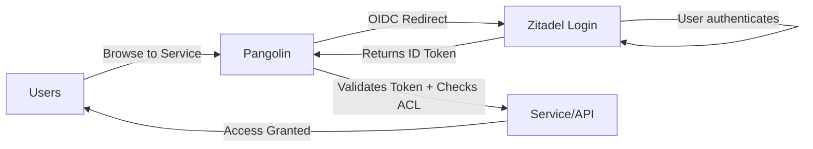

# Zitadel Setup

Zitadel is the **authoritative identity provider** for your infrastructure. It manages all user identities, authentication, and provides SSO to Pangolin and all downstream services.

---

## Architecture



**Flow:**
1. User tries to access a protected resource
2. Pangolin redirects to Zitadel for authentication
3. User logs in with Zitadel credentials (Pangolin never sees the password)
4. Zitadel returns an ID token with user claims and roles
5. Pangolin validates the token and grants access based on policies

---

## Overview

Zitadel provides:
- **Single Sign-On (SSO)** across all services via OIDC/OAuth2
- **Authoritative identity** — single source of truth for users and roles
- **Multi-factor authentication** (MFA)
- **User self-service** (password reset, profile management)
- **Role-based access control** (RBAC) — integrated with Pangolin policies
- **Audit logging** — track all authentication events

---

## Prerequisites

Before proceeding, ensure you've completed the [Initial Configuration](./post-deployment) guide:

- [ ] Gateway VPS stack is deployed and running
- [ ] Pangolin dashboard is accessible
- [ ] Admin account created in Pangolin

---

## Expose Zitadel via Pangolin

First, create a resource in Pangolin to route traffic to the Zitadel containers.

### 1. Create the Zitadel Resource

1. Open **Pangolin Dashboard** (`https://pangolin.yourdomain.com`)
2. Navigate to your site → **Resources** → **Add Resource**
3. Configure the resource:

| Field | Value |
|-------|-------|
| **Name** | Zitadel |
| **Subdomain** | `auth` (or your chosen subdomain) |
| **Domain** | `yourdomain.com` |

### 2. Configure Target Routing

Zitadel uses a **Login V2 sidecar** that requires path-based routing. Enable **Advanced Mode** and configure two targets:

| Match Path | Type | Host | Port | Priority |
|------------|------|------|------|----------|
| `/ui/v2/login` | Prefix | `zitadel_login` | `3000` | **200** |
| *(empty)* | — | `zitadel` | `8080` | 100 |

:::warning Priority Order
The `/ui/v2/login` route **must have higher priority** (200) than the catch-all route (100) to ensure login requests go to the correct backend.
:::

### 3. Save and Verify

1. Click **Save**
2. Wait for the SSL certificate to provision
3. Open `https://auth.yourdomain.com` — you should see the Zitadel login page

---

## Initial Access

After deploying the Gateway VPS stack, access Zitadel:

1. Open `https://auth.yourdomain.com` in your browser
2. Log in with the default admin credentials:
   - **Username**: `zitadel-admin@zitadel.localhost`
   - **Password**: Check the logs for the initial password

```bash
docker compose logs zitadel | grep -i password
```

:::warning Change Default Password
Immediately change the default admin password after first login.
:::

---

## Initial Configuration

### 1. Create Your Organization

1. Go to **Organization** in the sidebar
2. Click **New Organization**
3. Enter your organization name (e.g., `KyleHub`)
4. Set your domain (e.g., `kylehub.dev`)

### 2. Create the Main Project

1. Navigate to **Projects**
2. Click **Create New Project**
3. Name it `KyleHub` (or your project name)
4. Enable **Assert Roles on Authentication**

### 3. Create the Auth Application

This application represents **Pangolin's OIDC integration**. Pangolin will use this application's credentials to authenticate users via Zitadel.

1. Inside your project, click **New** → **Application**
2. Configure:
   - **Name**: `KyleHub-Auth` (represents Pangolin)
   - **Type**: Web
   - **Authentication Method**: Code (Officially recommended and secure enough for this setup)

3. **Leave Redirect URIs blank** for now. We'll come back to this once the Identity Provider is created in Pangolin.

4. Click **Create** and securely save the **Client ID** and **Client Secret**.
   :::warning Save Credentials
   Make sure to save these somewhere secure - you won't be able to see the Client Secret again.
   :::

---

## Token Configuration

After creating the application, you need to configure how tokens are generated to ensure Pangolin can read user roles and identification.

1. Navigate to your application (**KyleHub-Auth**) and click **Token settings**.

2. Configure the following:
   - **Auth Token Type**: `JWT`
   - ✅ **User roles inside ID Token**
   - ✅ **User Info inside ID Token**

3. Click **Save**.

4. **Project Level Settings**:
   - Go to **Projects** → **KyleHub** → **Settings**.
   - Enable ✅ **Return user roles during authentication** (Assert Roles).
   - Enable ✅ **Only authorized users can authenticate** (Recommended for security).

:::note Why these settings?
Enabling **User roles inside ID Token** and **User Info inside ID Token** allows Zitadel to include necessary user profile claims (including `preferred_username`) and roles in the ID token. Enabling **Return user roles** ensures those roles are actually sent during the login flow.
:::

4. Open **URLs** (bottom of the application page or via the project menu) and make note of:
   - `Authorization Endpoint`
   - `Token Endpoint`

---

## Role Configuration

### Create Category Roles

Create roles for different access levels. It is highly recommended to use **Title Case** (e.g., `Admin`) to match Pangolin's internal default roles, allowing for automatic mapping:

1. Go to **Projects** → **KyleHub** → **Roles**
2. Create these roles:

| Role Key | Display Name | Description |
|----------|--------------|-------------|
| `Admin` | Administrator | Full access to all services |
| `Member` | Member | General access to services |
| `Homelab` | Homelab | Access to homelab services |
| `Dev` | Developer | Access to development tools |

### Assign Roles to Users

1. Go to **Users** → Select a user
2. Navigate to **Authorizations**
3. Add authorization for the `KyleHub` project
4. Select appropriate roles

---

## Integrate with Pangolin

### 1. Open Pangolin Admin

Navigate to `https://pangolin.yourdomain.com` and go to **Admin** → **Identity Providers**.

### 2. Add Identity Provider

Click **Add Identity Provider** and configure:

| Field | Value |
|-------|-------|
| **Name** | Zitadel |
| **Auto Provision** | ON |
| **Provider Type** | OAuth2/OIDC |
| **Client ID** | From Zitadel |
| **Client Secret** | From Zitadel |
| **Authorization URL** | `https://auth.yourdomain.com/oauth/v2/authorize` |
| **Token URL** | `https://auth.yourdomain.com/oauth/v2/token` |
| **Scopes** | `openid profile email offline_access` |
| **Identifier Path** | `preferred_username` |

:::tip Refresh Tokens
The `offline_access` scope allows Pangolin to request **Refresh Tokens**, which provides longer-lived sessions without requiring frequent re-authentication. Ensure you also enable the **Refresh Token** checkbox in Zitadel's OIDC Configuration.
:::

:::warning URL Configuration
- **Authorization URL**: Must be the **external HTTPS URL** (e.g., `https://auth.yourdomain.com/oauth/v2/authorize`). This is used by the browser.
- **Token URL**: Use the **HTTPS URL** (e.g., `https://auth.yourdomain.com/oauth/v2/token`). This is a server-to-server call from Pangolin to Zitadel.

**Bypassing Cloudflare WAF/Bot Protection:**

Since the Token URL is called from your server (not the browser), Cloudflare might block it as "bot traffic." To keep this traffic internal while maintaining HTTPS, add a **network alias** to the `gerbil` service in your `compose.yaml`:

```yaml
gerbil:
  # ... existing config ...
  networks:
    default:
      aliases:
        - ${ZITADEL_DOMAIN}  # e.g., auth.yourdomain.com
```

**How this works:**
1. Pangolin calls `https://auth.yourdomain.com/oauth/v2/token`
2. Docker resolves `auth.yourdomain.com` to the `gerbil` container (via the alias)
3. Traefik (running in gerbil's network) terminates SSL and routes to Zitadel internally
4. The request never leaves your VPS, bypassing Cloudflare entirely
:::

### 3. Configure Token Mapping

To ensure Pangolin can extract user roles and identify which organization they belong to, you need to configure the **Organization Policies**.

1. In Pangolin Admin, go to **Identity Providers** → **Zitadel**.
2. Navigate to the **Organization Policies** tab.
3. In the **Default Mappings (Optional)** section, configure the following:

| Field | Value |
|-------|-------|
| **Default Role Mapping** | `keys("urn:zitadel:iam:org:project:roles") \| [0]` |
| **Default Organization Mapping** | `` `true` `` |

:::note Understanding the JMESPath Expressions
Pangolin uses **JMESPath** to evaluate these fields against the ID token from Zitadel.

**Role Mapping Explained:**
Zitadel returns roles as an object like `{"Dev": {...}, "Admin": {...}}`. The expression:
- `keys("urn:zitadel:iam:org:project:roles")` → Extracts the role names as an array: `["Dev", "Admin"]`
- `| [0]` → Returns the first role: `"Dev"`

If a user has multiple roles and you want to match a specific one, use:
```
keys("urn:zitadel:iam:org:project:roles")[?@ == 'Admin'] | [0]
```

**Organization Mapping Explained:**
The backticks around `true` (`` `true` ``) create a JMESPath **literal**. This tells Pangolin to always return the boolean `true`, accepting any authenticated user into the organization.
:::

:::tip JMESPath Syntax
Make sure to wrap the roles claim path in **double quotes** (`"`) because it contains special characters (colons).
:::

4. Click **Save Default Mappings**.

### 4. Save and Copy Callback URL

After clicking **Create Identity Provider**, go to the **General** tab of the newly created provider and copy the **Redirect URL** (Callback URL).

### 5. Update Zitadel Redirect URIs

Go back to Zitadel → **Applications** → **KyleHub-Auth** → **Redirect Settings**.

1. Add the URL you copied to the **Redirect URIs**.
2. Click the **+** button.
3. Click **Save**.

Your configuration is now complete. You can now add an external user to Pangolin or log in using Zitadel SSO if "Auto Provision Users" is enabled.

### 1. Create a Test User

1. In Zitadel, go to **Users** → **Create User**
2. Fill in details and set a password
3. Assign the `ADMIN` role via Authorizations

### 2. Test Login Flow

1. Open an incognito window
2. Go to `https://pangolin.yourdomain.com`
3. Click **Login with Zitadel**
4. Enter test user credentials
5. Verify redirect back to Pangolin

### 3. Verify Role Claims

Check that roles appear in Pangolin user settings after login.

---

## Troubleshooting

### Login redirects but fails / "NoCode" error

- Verify Redirect URIs match exactly in both Zitadel and Pangolin.
- Ensure the **Token URL** uses `https://` (not `http://`). Protocol mismatch causes session state issues.
- Clear browser cookies and try in an Incognito/Private window.
- Verify the **Client Secret** in Pangolin matches the one in Zitadel. If unsure, regenerate it in Zitadel.

### "Errors.IAM.NotFound" in Zitadel logs

This error occurs when Zitadel receives a request with a `Host` header it doesn't recognize.

**Example log:**
```
error="unable to get instance by domain: instanceDomain zitadel, publicHostname zitadel"
```

**Cause:** Calling Zitadel using the container name (`http://zitadel:8080`) sends `Host: zitadel`, which Zitadel doesn't recognize.

**Fix:** Use the actual domain name in the Token URL (e.g., `https://auth.yourdomain.com/oauth/v2/token`). The network alias on the `gerbil` service ensures this resolves internally.

### Cloudflare blocking token requests

If Cloudflare's WAF or Bot Protection blocks server-to-server token requests:

**Fix:** Add the network alias to your `gerbil` service (see URL Configuration section above). This routes traffic through Traefik internally, bypassing Cloudflare.

### Roles not appearing

- Confirm "Assert Roles on Authentication" is enabled
- Verify token settings include roles in ID token
- Check JMESPath syntax for roles claim

### "Invalid token" errors

- Ensure Zitadel and Pangolin clocks are synchronized
- Verify the correct Client Secret is configured

### DNS resolution issues

If using AdGuard Home for internal DNS, add a rewrite rule:
- **Domain**: `auth.yourdomain.com`
- **Answer**: Zitadel's internal IP

---

## Next Steps

1. **[Configure SSO for services](/docs/service-configuration/configure-sso)** — Protect resources with authentication
2. **Create more roles** — Add granular access control in Zitadel console
3. **Enable MFA** — Configure multi-factor authentication in Zitadel settings
