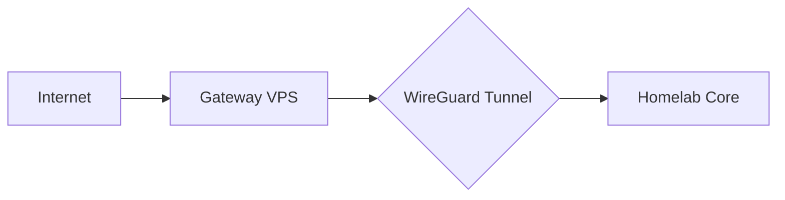

# Getting Started

Welcome to KyleHub Infrastructure! This guide will help you deploy a hybrid cloud architecture connecting a public VPS gateway with your private homelab.

---

## Overview

KyleHub Infrastructure consists of two main components:

| Component | Location | Purpose |
|-----------|----------|---------|
| **Gateway VPS** | Cloud (Hetzner, DigitalOcean, etc.) | Public ingress, authentication, reverse proxy |
| **Homelab Core** | Your private network | Services, compute, storage |

These components are connected via secure WireGuard tunnels managed by Pangolin's NEWT agent.



---

## Prerequisites

Before you begin, ensure you have:

### Required

- [ ] **Domain name** with DNS management (Cloudflare recommended)
- [ ] **VPS** with a public IP (minimum: 2 vCPU, 4GB RAM)
- [ ] **Docker & Docker Compose** installed on both VPS and homelab
- [ ] **Git** installed on both systems
- [ ] **SSH access** to your VPS

### Recommended

- [ ] **Cloudflare account** (for DNS management and optional proxy)
- [ ] **Proxmox VE** for homelab virtualization
- [ ] **UniFi DreamMachine Pro** or similar router/firewall

### Environment

You'll need to set up these secrets/credentials:

| Secret | Description | How to Generate |
|--------|-------------|-----------------|
| `PANGOLIN_SERVER_SECRET` | Session encryption key | `openssl rand -hex 32` |
| `ZITADEL_MASTERKEY` | Zitadel encryption key | `openssl rand -base64 32 \| cut -c1-32` |
| `POSTGRES_PASSWORD` | Database password | Use a password manager |
| `CF_DNS_API_TOKEN` | Cloudflare API token | Create in Cloudflare dashboard |

---

## Quick Start

### Step 1: Clone the Repository

```bash
git clone https://github.com/KyleHub-Dev/infrastructure.git
cd infrastructure
```

### Step 2: Deploy Gateway VPS

On your VPS:

```bash
cd gateway-vps

# Create environment file from template
cp .env.example .env

# Edit with your values
nano .env
```

Fill in the required environment variables:

```bash
# Key variables to configure
DOMAIN_ROOT=yourdomain.com
PANGOLIN_SUBDOMAIN=pangolin
VPS_PUBLIC_IP=your.vps.ip.address
ACME_EMAIL=admin@yourdomain.com
ZITADEL_DOMAIN=auth.yourdomain.com
```

Generate the config and start services:

```bash
# Generate Pangolin config from template
./init_config.sh

# Start all services
docker compose up -d

# Check logs
docker compose logs -f
```

### Step 3: Complete Pangolin Setup

1. Open `https://pangolin.yourdomain.com` in your browser
2. Enter the setup token (found in logs: `docker compose logs pangolin | grep Token`)
3. Create your admin account
4. Configure organization settings

### Step 4: Deploy Homelab Core

On your homelab server:

```bash
cd homelab-core

# Create environment file
cp .env.example .env
nano .env

# Start services
docker compose up -d
```

### Step 5: Connect NEWT Agent

In the Pangolin dashboard:

1. Navigate to **Sites** → **Create Site**
2. Select **NEWT** as the connection type
3. Copy the NEWT configuration/token
4. Add it to your homelab's `.env` file
5. Restart the NEWT agent: `docker compose restart newt`

---

## What's Next?

After completing the basic setup:

1. **[Configure Zitadel](/docs/gateway-vps/zitadel-setup)** — Set up SSO for all services
2. **[Add Resources](/docs/service-configuration/expose-services)** — Expose homelab services through Pangolin
3. **[Configure SSO](/docs/service-configuration/configure-sso)** — Protect services with authentication
4. **[Set up Services](/docs/services)** — Deploy Langfuse, AdGuard, and more

---

## Deployment Checklist

Use this checklist to track your progress:

```
□ Gateway VPS
  □ Clone repository
  □ Configure .env file
  □ Run init_config.sh
  □ Start Docker Compose
  □ Complete Pangolin initial setup
  □ Verify Zitadel is accessible

□ Homelab Core
  □ Clone repository
  □ Configure .env file
  □ Start Docker Compose
  □ Connect NEWT agent to VPS

□ Post-Deployment
  □ Configure Zitadel organization
  □ Create Identity Provider in Pangolin
  □ Add first resource/service
  □ Test authentication flow
```

---

## Troubleshooting

### Common Issues

#### Pangolin won't start
- Check that all required environment variables are set
- Verify `init_config.sh` ran successfully
- Check logs: `docker compose logs pangolin`

#### Zitadel database errors
- Ensure PostgreSQL is healthy: `docker compose ps`
- Check database logs: `docker compose logs zitadel_db`

#### NEWT won't connect
- Verify the NEWT token is correct
- Check VPS firewall allows WireGuard ports (51820/udp)
- Check homelab firewall allows outbound UDP

#### SSL certificate errors
- Verify DNS records point to your VPS
- Check Cloudflare API token has correct permissions
- Review Traefik logs: `docker compose logs traefik`

For more detailed troubleshooting, see the [Troubleshooting Guide](/docs/troubleshooting).
