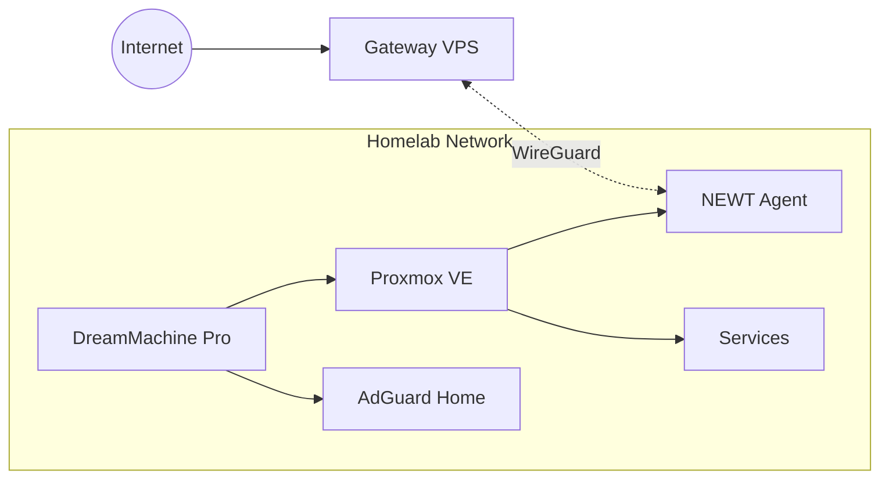

# Homelab Setup

The Homelab Core is your private infrastructure. It runs services behind your home network with zero open ports, connecting to the Gateway VPS through secure WireGuard tunnels.

---

## Overview

### Architecture



### Key Principles

- **Zero open ports** — No port forwarding required
- **NEWT tunnels** — Secure WireGuard connection to VPS
- **Proxmox VE** — Hypervisor for VMs and containers
- **DreamMachine Pro** — Router/firewall (or similar)
- **AdGuard Home** — Local DNS and ad blocking (optional)

---

## Network Components

| Component | Role | Notes |
|-----------|------|-------|
| **UniFi DreamMachine Pro** | Router/Firewall | Manages home network |
| **Proxmox VE** | Hypervisor | Runs VMs and LXC containers |
| **NEWT Agent** | Tunnel client | Connects to VPS gateway |
| **AdGuard Home** | DNS server | Network-wide ad blocking |

### Network Topology

```
Internet
    │
    ├── [DreamMachine Pro] ─── WAN
    │           │
    │           ├── VLAN 1: Management (10.0.1.0/24)
    │           ├── VLAN 10: Servers (10.0.10.0/24)
    │           ├── VLAN 20: IoT (10.0.20.0/24)
    │           └── VLAN 30: Guests (10.0.30.0/24)
    │
    └── Proxmox VE (10.0.10.10)
            │
            ├── AdGuard Home (10.0.10.11)
            ├── NEWT Agent (10.0.10.12)
            └── Services (10.0.10.x)
```

---

## Prerequisites

Before deploying the homelab stack:

### Hardware

- [ ] Server capable of running Proxmox (or Docker directly)
- [ ] Router with firewall capabilities
- [ ] Sufficient storage for services

### Software

- [ ] Proxmox VE installed (recommended) or Docker/Docker Compose
- [ ] Gateway VPS deployed and running
- [ ] NEWT token from Pangolin dashboard

### Network

- [ ] Static IP for server(s)
- [ ] DNS configured (AdGuard Home or other)
- [ ] Outbound UDP allowed for WireGuard

---

## Quick Setup

### Option A: Docker Compose (Direct)

If running Docker directly on a server:

```bash
cd homelab-core

# Configure environment
cp .env.example .env
nano .env

# Add NEWT token from Pangolin dashboard
# Deploy
docker compose up -d
```

### Option B: Proxmox LXC Container

For Proxmox deployments:

1. Create an LXC container (Debian 13 recommended)
2. Install Docker inside the container
3. Clone the repository
4. Deploy with Docker Compose

See [Proxmox Container Setup](./proxmox-container-setup) for details.

---

## Directory Structure

```
homelab-core/
├── compose.yaml          # Main Docker Compose file
├── .env.example          # Environment template
├── .env                  # Your configuration (gitignored)
│
└── services/
    └── langfuse/         # Langfuse service files
        ├── compose.yaml  # Service-specific compose
        └── README.md     # Service documentation
```

---

## Services Included

| Service | Description | Status |
|---------|-------------|--------|
| **NEWT** | WireGuard tunnel agent | Core |
| **Langfuse** | LLM observability | Included |

### Adding New Services

1. Create a directory under `services/`
2. Add `compose.yaml` for the service
3. Include in main compose or run separately
4. Create resource in Pangolin dashboard

---

## Next Steps

1. **[NEWT Connection](./newt-connection)** — Connect to VPS gateway
2. **[Add Services](./adding-services)** — Deploy additional services
