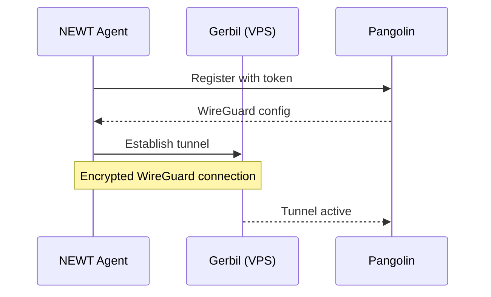

# NEWT Connection

NEWT (Network Edge Wireguard Tunnel) is the agent that creates a secure tunnel between your homelab and the Gateway VPS.

---

## How NEWT Works



Key points:
- NEWT **initiates** the connection (outbound only)
- No inbound ports needed on your router
- Traffic is encrypted with WireGuard
- Automatic reconnection on network changes

---

## Prerequisites

Before connecting NEWT:

- [ ] Gateway VPS is deployed and healthy
- [ ] Site created in Pangolin with NEWT type
- [ ] NEWT token copied from Pangolin dashboard

---

## Get NEWT Token

### From Pangolin Dashboard

1. Log in to `https://pangolin.yourdomain.com`
2. Navigate to **Sites**
3. Select your homelab site (or create one)
4. Go to **NEWT** tab
5. Copy the **NEWT Token** or connection string

The token looks like:
```
newt://token_xxxxxxxxxxxxxxxxxxxxxxxxxxxxx@pangolin.yourdomain.com
```

---

## Configure NEWT

### Environment Variables

Add to your `homelab-core/.env`:

```bash
# NEWT Configuration
PANGOLIN_SERVER=https://pangolin.yourdomain.com
NEWT_TOKEN=token_xxxxxxxxxxxxxxxxxxxxxxxxxxxxx
```

### Docker Compose Service

The NEWT service in `compose.yaml`:

```yaml
services:
  newt:
    image: fosrl/newt:latest
    container_name: newt
    restart: always
    environment:
      - PANGOLIN_ENDPOINT=${PANGOLIN_SERVER}
      - NEWT_ID=${NEWT_TOKEN}
    cap_add:
      - NET_ADMIN
    sysctls:
      - net.ipv4.ip_forward=1
    networks:
      - homelab-net
```

---

## Deploy NEWT

```bash
cd homelab-core

# Start NEWT agent
docker compose up -d newt

# Check logs
docker compose logs -f newt
```

### Successful Connection

Look for these log messages:

```
[INFO] Connecting to Pangolin server...
[INFO] WireGuard interface configured
[INFO] Tunnel established successfully
```

---

## Verify Connection

### From Pangolin Dashboard

1. Go to **Sites** → Your homelab site
2. Check the **Status** indicator (should be green)
3. View **Connected Since** timestamp

### From Homelab

Test connectivity through the tunnel:

```bash
# Ping the VPS through the tunnel
docker exec newt ping -c 3 10.0.0.1
```

---

## Network Configuration

### Exposing Services

Services must be accessible from the NEWT container. Options:

**Option A: Same Docker Network**

```yaml
services:
  newt:
    networks:
      - homelab-net
  
  my-service:
    networks:
      - homelab-net

networks:
  homelab-net:
    driver: bridge
```

**Option B: Host Networking** (for services outside Docker)

```yaml
services:
  newt:
    network_mode: host
```

### Service Discovery

When creating resources in Pangolin, use:
- **Same network**: Container name as hostname (e.g., `langfuse`)
- **Different network**: IP address of the service

---

## Adding Resources

After NEWT is connected, add resources in Pangolin:

1. Go to **Sites** → Your homelab site → **Resources**
2. Click **Add Resource**
3. Configure:
   - **Name**: Service name (e.g., `Langfuse`)
   - **Subdomain**: URL subdomain (e.g., `langfuse`)
   - **Target**: Internal address (e.g., `http://langfuse:3000`)
4. Enable authentication if needed
5. Save

The service is now accessible at `https://langfuse.yourdomain.com`.

---

## Troubleshooting

### NEWT won't start

```bash
# Check logs
docker compose logs newt

# Verify environment variables
docker compose config | grep -A5 newt
```

**Common issues:**
- Invalid token format
- Missing `NET_ADMIN` capability
- Firewall blocking outbound UDP

### Tunnel disconnects frequently

**Possible causes:**
- Unstable internet connection
- ISP blocking WireGuard
- VPS firewall misconfigured

**Solutions:**
- Check WireGuard ports (51820, 21820) are open on VPS
- Try the secondary port if primary fails
- Enable keepalive in WireGuard config

### Services not reachable through tunnel

1. Verify service is running: `docker compose ps`
2. Check service is on the correct network
3. Test local connectivity first:
   ```bash
   docker exec newt curl http://service-name:port
   ```

### "Permission denied" errors

NEWT needs `NET_ADMIN` capability:

```yaml
cap_add:
  - NET_ADMIN
```

For Proxmox LXC, ensure the container is privileged or has appropriate capabilities.

---

## Advanced Configuration

### Custom WireGuard Settings

Override default WireGuard settings:

```yaml
environment:
  - WG_PERSISTENT_KEEPALIVE=25
  - WG_MTU=1420
```

### Multiple Sites

Deploy multiple NEWT agents for different sites:

```yaml
services:
  newt-primary:
    image: fosrl/newt:latest
    environment:
      - NEWT_ID=${NEWT_TOKEN_PRIMARY}
  
  newt-secondary:
    image: fosrl/newt:latest
    environment:
      - NEWT_ID=${NEWT_TOKEN_SECONDARY}
```

---

## Next Steps

1. **[Expose Services](/docs/post-deployment/expose-services)** — Add resources in Pangolin
2. **[Configure SSO](/docs/post-deployment/configure-sso)** — Protect services with Zitadel
3. **[Add Services](./adding-services)** — Deploy more services
