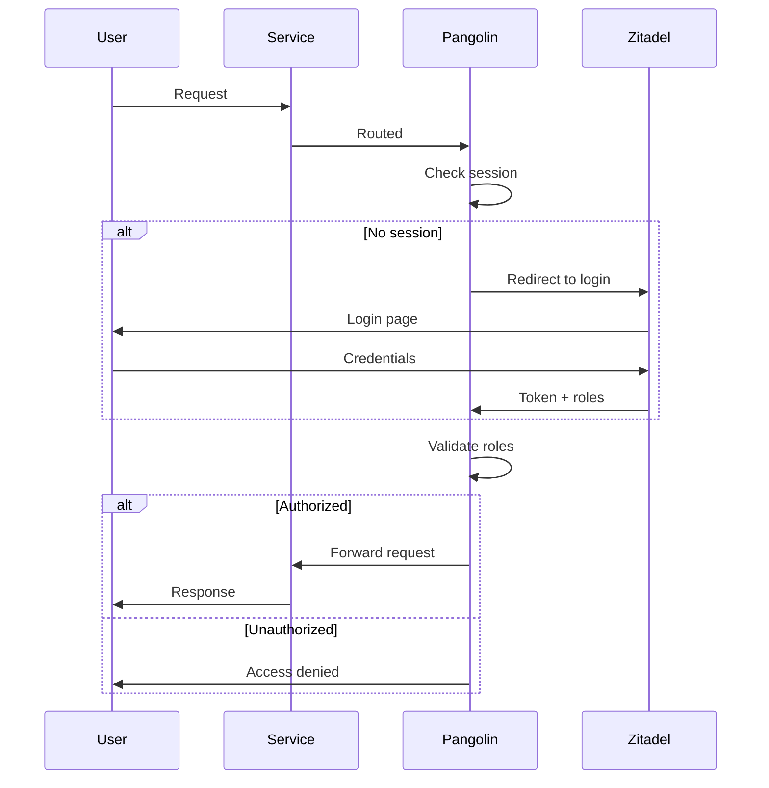
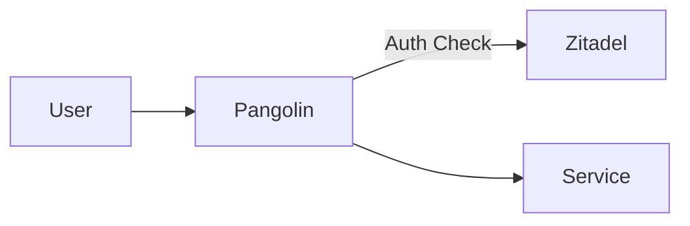
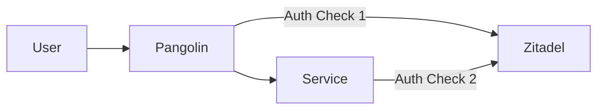

# Configure SSO for Services

This guide explains how to protect your services with Zitadel Single Sign-On (SSO) through Pangolin.

---

## Overview

SSO enables users to log in once and access all authorized services. Pangolin acts as a gatekeeper, validating authentication before allowing access.



---

## Prerequisites

Before configuring SSO:

- [ ] Zitadel is running and accessible
- [ ] Identity Provider configured in Pangolin ([see guide](/docs/gateway-vps/zitadel-setup))
- [ ] Roles created in Zitadel project
- [ ] Users assigned appropriate roles

---

## Enable SSO for a Resource

### 1. Edit Resource

1. Navigate to **Sites** → Your site → **Resources**
2. Click on the resource to edit
3. Scroll to **Authentication** section

### 2. Configure Authentication

| Setting | Description |
|---------|-------------|
| **Require Authentication** | Toggle ON |
| **Identity Provider** | Select `Zitadel` |

### 3. Configure Role Requirements (Optional)

To require specific roles:

| Setting | Description |
|---------|-------------|
| **Required Roles** | List of roles that grant access |
| **Role Match** | `Any` (one role) or `All` (all roles) |

Example:
```
Required Roles: ADMIN, HOMELAB
Role Match: Any
```

This allows users with `ADMIN` OR `HOMELAB` roles.

### 4. Save Changes

Click **Save**. Changes take effect immediately.

---

## Role-Based Access Control

### Category-Based Access

Use broad category roles:

| Role | Access |
|------|--------|
| `ADMIN` | All services |
| `HOMELAB` | Homelab services |
| `DEV` | Development tools |
| `MEDIA` | Media services |

**Pangolin Configuration:**
```
Required Roles: HOMELAB
```

### Service-Specific Access

Use granular service roles:

| Role | Access |
|------|--------|
| `ACCESS_PROXMOX` | Proxmox only |
| `ACCESS_GRAFANA` | Grafana only |
| `ACCESS_PORTAINER` | Portainer only |

**Pangolin Configuration:**
```
Required Roles: ACCESS_PROXMOX
```

### Combined Access

Allow multiple role patterns:

```
Required Roles: ADMIN, ACCESS_PROXMOX
Role Match: Any
```

This grants access to:
- Users with `ADMIN` role (full access)
- Users with `ACCESS_PROXMOX` role (specific access)

---

## Service-Specific SSO Patterns

### Pattern A: Pangolin SSO (Recommended for Simple Services)

Pangolin handles all authentication:



**Best for:**
- Services without native SSO
- Quick setup
- Consistent auth experience

**Configuration:**
- Enable SSO in Pangolin resource
- No configuration needed in the service

### Pattern B: Direct SSO (For Native OIDC Services)

Service handles its own OIDC:


**Best for:**
- Services with native OIDC (Grafana, Portainer)
- Role mapping within the service
- Advanced authorization

**Configuration:**
- Disable SSO in Pangolin resource
- Configure OIDC in the service directly

### Pattern C: Hybrid (Defense in Depth)

Both Pangolin and service check auth:



**Best for:**
- Maximum security
- Different role granularity needed
- Sensitive services

**Configuration:**
- Enable SSO in Pangolin (basic access)
- Configure OIDC in service (detailed permissions)

---

## Configuring Direct SSO

### Grafana Example

1. **Pangolin Resource:**
   - Authentication: None (Grafana handles auth)

2. **Grafana Configuration:**
   ```ini
   [auth.generic_oauth]
   enabled = true
   name = Zitadel
   client_id = your-client-id
   client_secret = your-client-secret
   scopes = openid profile email
   auth_url = https://auth.yourdomain.com/oauth/v2/authorize
   token_url = https://auth.yourdomain.com/oauth/v2/token
   api_url = https://auth.yourdomain.com/oidc/v1/userinfo
       role_attribute_path = contains("urn:zitadel:iam:org:project:roles".*, 'ADMIN') && 'Admin' || 'Viewer'   ```

### Portainer Example

1. **Pangolin Resource:**
   - Authentication: SSO with `HOMELAB` role (basic access gate)

2. **Portainer Configuration:**
   - Settings → Authentication → OAuth
   - Use Zitadel OIDC endpoints

### Langfuse Example

1. **Pangolin Resource:**
   - Authentication: SSO (Langfuse's built-in auth is minimal)

2. **Langfuse .env:**
   ```
   AUTH_CUSTOM_ID=zitadel
   AUTH_CUSTOM_NAME=Zitadel
   AUTH_CUSTOM_ISSUER=https://auth.yourdomain.com
   AUTH_CUSTOM_CLIENT_ID=your-client-id
   AUTH_CUSTOM_CLIENT_SECRET=your-client-secret
   ```

---

## Testing SSO

### Test Authentication Flow

1. Open incognito browser window
2. Navigate to protected service
3. Verify redirect to Zitadel
4. Log in with test user
5. Verify redirect back to service

### Test Role Enforcement

1. Create test user with limited roles
2. Assign only `ACCESS_SERVICE_A` role
3. Verify:
   - ✅ Can access `service-a.yourdomain.com`
   - ❌ Cannot access `service-b.yourdomain.com`

### Debug Role Claims

Check the token contains expected roles:

1. Log in to Zitadel as the user
2. Go to User Settings → Sessions
3. View token claims
4. Verify roles appear in `urn:zitadel:iam:org:project:roles`

---

## Troubleshooting

### "Unauthorized" after login

**Possible causes:**
- User doesn't have required role
- Role assertion not enabled in Zitadel

**Solutions:**
1. Check user's role assignments in Zitadel
2. Verify "Assert Roles on Authentication" is enabled
3. Check Pangolin's required roles configuration

### Login loop (redirects repeatedly)

**Possible causes:**
- Callback URL mismatch
- Cookie issues

**Solutions:**
1. Verify callback URL in Zitadel matches Pangolin
2. Check browser accepts cookies from both domains
3. Clear browser cache and try again

### Roles not appearing in token

**Possible causes:**
- Token settings not configured
- User not authorized for project

**Solutions:**
1. Enable "Add User Roles to Access Token" in Zitadel
2. Ensure user has authorization for the project
3. Verify role claim path in Pangolin uses correct JMESPath

### "Invalid state" error

**Possible causes:**
- Session expired during login
- Multiple tabs open

**Solutions:**
1. Close other tabs and retry
2. Check clock synchronization between servers

---

## Best Practices

### Role Design

1. **Start broad, refine later**: Use category roles initially
2. **Least privilege**: Grant minimum required access
3. **Document roles**: Maintain a role → service matrix

### Security Layers

| Layer | Protection |
|-------|------------|
| Cloudflare | DDoS, WAF |
| Pangolin SSO | Authentication gate |
| Service Auth | Authorization details |
| App Logic | Fine-grained permissions |

### Monitoring

1. Review Zitadel audit logs regularly
2. Set up alerts for failed auth attempts
3. Monitor Pangolin access logs

---

## Next Steps

1. **[Zitadel Domain Setup](./zitadel-domain)** — Custom domain for Zitadel
2. **Create advanced roles** — Design role hierarchy in Zitadel console
3. **Enable MFA** — Configure multi-factor authentication in Zitadel
