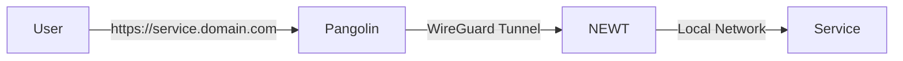

# Expose Services Through Pangolin

This guide explains how to make your homelab services accessible via public subdomains using Pangolin.

---

## Overview

Pangolin manages the routing from public subdomains to your internal services through NEWT tunnels.



---

## Prerequisites

Before exposing services:

- [ ] Gateway VPS deployed and healthy
- [ ] Homelab NEWT agent connected
- [ ] Service running and accessible locally
- [ ] (Optional) Zitadel configured for authentication

---

## Step-by-Step: Add a Resource

### 1. Log in to Pangolin

Navigate to `https://pangolin.yourdomain.com` and log in.

### 2. Navigate to Resources

1. Click **Sites** in the sidebar
2. Select your homelab site
3. Click **Resources** tab
4. Click **Add Resource**

### 3. Configure Basic Settings

| Field | Description | Example |
|-------|-------------|---------|
| **Name** | Display name for the resource | `Langfuse` |
| **Subdomain** | The subdomain to use | `langfuse` |
| **Site** | Which NEWT site to route through | `Homelab` |

### 4. Configure Target

| Field | Description | Example |
|-------|-------------|---------|
| **Protocol** | HTTP or HTTPS | `http` |
| **Target Host** | Container name or IP | `langfuse-web` |
| **Target Port** | Service port | `3000` |

:::tip Container Names
When services are on the same Docker network as NEWT, use the container name as the target host.
:::

### 5. Configure Authentication (Optional)

| Option | Description |
|--------|-------------|
| **None** | Anyone can access |
| **SSO Required** | Must log in via Zitadel |
| **Role Required** | Must have specific role |

### 6. Save and Test

1. Click **Save** or **Create**
2. Wait 30-60 seconds for DNS and SSL provisioning
3. Open `https://langfuse.yourdomain.com`

---

## Resource Types

### HTTP Resource

Standard web service:

| Setting | Value |
|---------|-------|
| Protocol | `http` |
| Target | `service-name:port` |

### HTTPS Resource

Service with its own SSL:

| Setting | Value |
|---------|-------|
| Protocol | `https` |
| Target | `service-name:port` |
| Skip Verify | Enable for self-signed certs |

### TCP/UDP Resource

Non-HTTP services (databases, game servers):

| Setting | Value |
|---------|-------|
| Type | `TCP` or `UDP` |
| Port | External port to expose |
| Target | `service-name:port` |

---

## Authentication Options

### No Authentication

Service is publicly accessible:

```yaml
Authentication: None
```

**Use for:**
- Public websites
- APIs with their own auth
- Services using Identity Kit

### SSO Required

Requires Zitadel login:

```yaml
Authentication: SSO
Identity Provider: Zitadel
```

**Use for:**
- Admin dashboards
- Internal tools
- Development environments

### Role Required

Requires specific Zitadel role:

```yaml
Authentication: SSO
Identity Provider: Zitadel
Required Roles:
  - admin
  - homelab
```

**Use for:**
- Sensitive services
- Admin-only tools
- Environment-specific access

---

## Examples

### Langfuse (LLM Observability)

| Setting | Value |
|---------|-------|
| Name | Langfuse |
| Subdomain | `langfuse` |
| Protocol | HTTP |
| Target | `langfuse-web:3000` |
| Auth | SSO with `services` role |

### Portainer (Docker Management)

| Setting | Value |
|---------|-------|
| Name | Portainer |
| Subdomain | `portainer` |
| Protocol | HTTPS |
| Target | `portainer:9443` |
| Skip Verify | ✅ |
| Auth | SSO with `admin` role |

### Proxmox (Hypervisor)

| Setting | Value |
|---------|-------|
| Name | Proxmox VE |
| Subdomain | `proxmox` |
| Protocol | HTTPS |
| Target | `192.168.10.10:8006` |
| Skip Verify | ✅ |
| Auth | SSO with `admin` role |

### Home Assistant

| Setting | Value |
|---------|-------|
| Name | Home Assistant |
| Subdomain | `home` |
| Protocol | HTTP |
| Target | `homeassistant:8123` |
| Auth | None (HA has own auth) |

---

## DNS Configuration

### Automatic DNS (Recommended)

If Pangolin manages your Cloudflare DNS:
- DNS records are created automatically
- SSL certificates are provisioned automatically

### Manual DNS

If managing DNS manually, create these records:

| Type | Name | Value |
|------|------|-------|
| A | `service` | Your VPS IP |
| CNAME | `service` | `pangolin.yourdomain.com` |

---

## Troubleshooting

### "502 Bad Gateway"

The target service is unreachable:

1. Verify service is running:
   ```bash
   docker compose ps
   ```

2. Test connectivity from NEWT:
   ```bash
   docker exec newt curl http://service:port
   ```

3. Check service is on correct network

### "503 Service Unavailable"

NEWT tunnel may be disconnected:

1. Check NEWT status in Pangolin dashboard
2. Restart NEWT agent:
   ```bash
   docker compose restart newt
   ```

### SSL Certificate Errors

Certificate provisioning failed:

1. Verify DNS points to VPS
2. Check Traefik logs:
   ```bash
   docker compose logs traefik
   ```
3. Wait and retry (rate limits)

### "Unauthorized" with SSO

Role check failed:

1. Verify user has required role in Zitadel
2. Check Identity Provider configuration
3. Review Pangolin access logs

---

## Best Practices

### Naming Conventions

Use consistent subdomain naming:

| Service Type | Pattern | Example |
|-------------|---------|---------|
| Admin tools | `tool.domain.com` | `proxmox.domain.com` |
| User apps | `app.domain.com` | `photos.domain.com` |
| APIs | `api.domain.com` | `api.domain.com` |
| Dev/staging | `dev-app.domain.com` | `dev-blog.domain.com` |

### Security Layers

1. **Public services**: Use app's built-in auth or Identity Kit
2. **Internal tools**: Enable SSO with appropriate roles
3. **Sensitive tools**: SSO + role + Cloudflare access policies

### Documentation

Keep a list of exposed services:

| Subdomain | Service | Auth | Owner |
|-----------|---------|------|-------|
| `langfuse` | Langfuse | SSO | DevOps |
| `portainer` | Portainer | SSO+Admin | SysAdmin |

---

## Next Steps

1. **[Configure SSO](./configure-sso)** — Set up authentication for resources
2. **[Zitadel Domain Setup](./zitadel-domain)** — Configure identity provider domain
