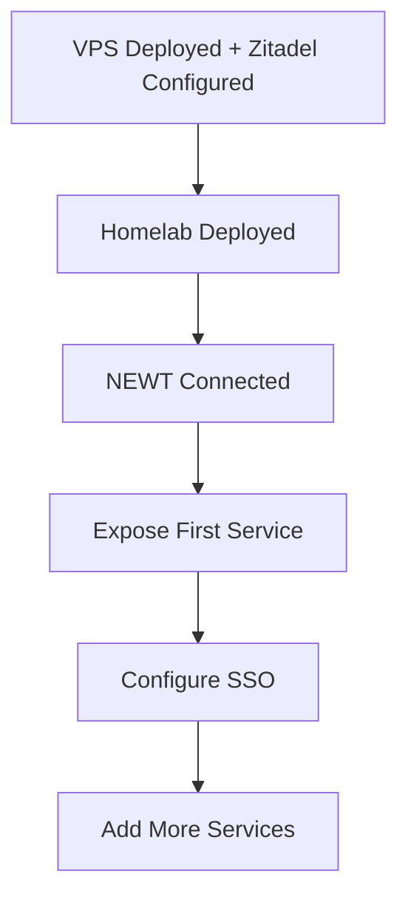

# Service Configuration

After deploying both the Gateway VPS and Homelab Core stacks, complete these configuration steps to expose and protect your services.

---

## Configuration Order



:::info Prerequisites
Before starting service configuration, ensure you've completed:
- [Gateway VPS Setup](/docs/gateway-vps) — including Zitadel configuration
- [Homelab Setup](/docs/homelab) — with NEWT connected
:::

---

## Configuration Checklist

### ✅ Verify Deployments

| Check | Command/Action |
|-------|----------------|
| VPS containers healthy | `docker compose ps` on VPS |
| Pangolin accessible | Open `https://pangolin.yourdomain.com` |
| Zitadel accessible | Open `https://auth.yourdomain.com` |
| Homelab containers running | `docker compose ps` on homelab |
| NEWT connected | Check Pangolin dashboard |

### 🔧 Complete Configuration

1. **[Expose Services](./expose-services)** — Add resources to Pangolin
2. **[Configure SSO](./configure-sso)** — Protect services with Zitadel authentication
3. **[Zitadel Domain Setup](./zitadel-domain)** — Configure custom domain in Zitadel

---

## Understanding the Flow

### Service Exposure

When you expose a service through Pangolin:

```
1. User requests → https://myservice.yourdomain.com
2. Cloudflare DNS → Points to VPS IP
3. Traefik → Terminates SSL, routes to Pangolin
4. Pangolin → Checks auth (if enabled)
5. Gerbil → Sends through WireGuard tunnel
6. NEWT → Forwards to local service
7. Service → Responds
```

### Authentication Flow

When SSO is enabled for a resource:

```
1. User requests service
2. Pangolin checks for valid session
3. If no session → Redirect to Zitadel
4. User logs in to Zitadel
5. Zitadel returns token with roles
6. Pangolin validates roles
7. If authorized → Allow access
```

---

## Quick Links

| Task | Guide |
|------|-------|
| Add a service to Pangolin | [Expose Services](./expose-services) |
| Require login for a service | [Configure SSO](./configure-sso) |
| Set up Zitadel domain | [Zitadel Domain Setup](./zitadel-domain) |
